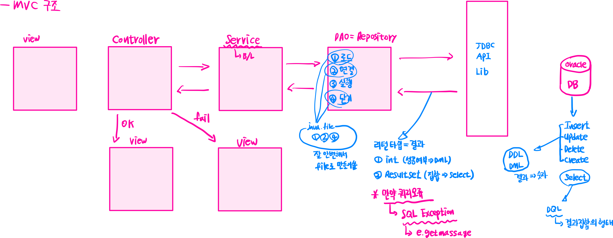
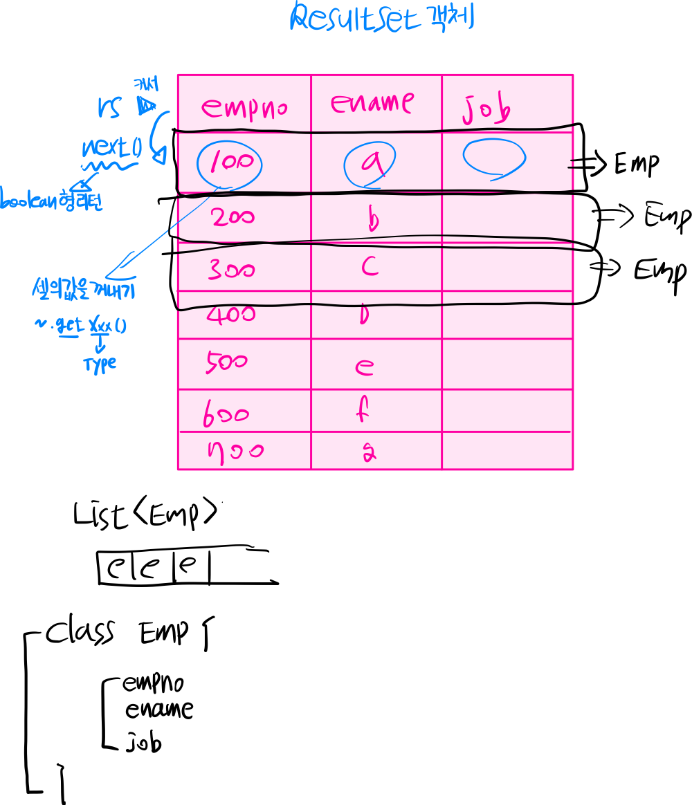
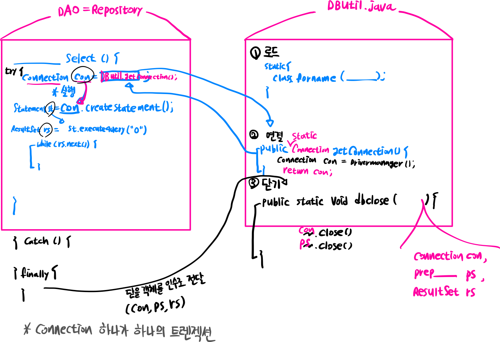

# JDBC API( Java + DataBase 연동 )
- mvc구조
- 
- java와 database를 연동해주는 api(이미 다 만들어서 lib형태로 제공)
- import java.sql.*;
- JDBC는 SQLException 예외처리가 필수 이다. - 체크예외종류


- 연동 순서!!!
  1) 로드 : 연결하려는 DB를 선택(이때 반드시 DB에 해당하는 드라이버 라이브러리 필요하다 = ~.jar파일)
            Class.forName("연결하려는 DB의 드라이버명");
     - 만약 드라이버명이 틀리거나 라이브러리가 없으면 ClassNotFoundException발생
     
            * Oracle : oracle.jdbc.driver.OracleDriver
              Ms_Sql : sun.jdbc.odbc.jdbcOdbcDriver
              My_Sql : org.git.mmm.mysql.Driver
     
  2) 연결 : 로드된 DB에 접속하는 과정 = 계정접속
            Connection con = DriverManager.getConnect(String url, String user, String pass);

  3) 실행 : DDL, DML, DQL에 해당하는 쿼리를 실행하는 과정 - 2가지 방법을 제공한다!!!
     1. Statement 방식
        * Statement st = con.createStatement();
            - DDL, DML 문장인 경우
              => int result = st.executeUpdate(String sql); // 인수로 전달된 쿼리의 결과가 성공여부인 int로 리턴된다.
              * 인수로 전달된 쿼리문장에 오류가 있으면 SQLExeption 발생!!
              * 결과가 0이면 적용된 레코드수가 없다는 것이고 1이상이면 적용이되었다!
              ```
              ex) int result = st.executeUpdate("delete from copy_emp where deptno = 20") // 쿼리를 오라클로 보내주는 역할
                  if(result == 0) System.out.println("삭제되지 않았습니다");
                  else System.out.println("삭제되었습니다");
              ```      
              - select 전용
                - ResultSet rs = st.executeQuery(String sql); // 인수로 전달된 문장이 Select인 경우
                
                  ```
                  ex) ResultSet rs = st.executeQuery("select empno, ename, job from emp")
                      List<Emp> empList = new ArratList<>();
                      while( rs.next() ) {
                        // next()는 앞으로 커서를 이동(이동이되면 true, 안되면 false)
                        int empno = rs.getInt(1); // 인수는 열의순서(index)
                        String ename = rs.getString(2);
                        String job = rs.getString("job"); // 인수는 String으로 컬럼명사용가능
                        Emp e = new Emp(empno, ename, job);
                        list.add(e)
                  
                        // 자바의 객체에 각 셀의(레코드) 값을 하나하나 저장 해서 레코드를 자바의 객체로 만든다.
                        // 한행의 객체를 list에 저장
                      }
                  ```
     2. PreparedStatement 방식
        - Statement객체를 상속!!!
        - 미리 문장을 준비해 놓고 필요한 값만 별도로 setXxx()설정 
        - sqlInjection공격을 방어할 수 있는 방식이다.
        
        ```
        PreparedStatement ps = con.prepareStatement(String sql);
        
        ex)
        String sql = "select ename from emp";
        String sql = "insert into emp(empno, ename, job, sal, hiredate) values(?, ?, ?, ?, sysdate)";
        PreparedStatement ps = con.prepareStatement(sql);
        
        // ?가 있다면 ?의 순서대로 개수만큼 setXxx(순서, 값); 설정을 해야한다.
        * insert문장을 예로 든다면
            ps.setInt(1, emp.getEmpno());
            ps.setString(2, emp.getEname());
            ps.setString(3, emp.getJob());
            ps.setInt(4, emp.getSal());
        
            * DB에 쿼리를 전송
            int result = ps.executeUpdate(); // Insert, update, delete, create인 경우
            if(result = 0) {
                System.out.println("실패");
            } else {
                System.out.println("성공");

            }
            ResultSet rs = ps.executeQuery(); // select인 경우
            
        ```

   4) 닫기 : 사용한 객체를 반납
      - close()를 한다.
      - SQLException 처리 필수
      - finally 블럭에서 한다. - try(~~){} 이 문법을 이용하면 try블럭을 빠져나올때 자동 close된다.
      
      ```
      ex) Connection, Statement(= PreparedStatement), ResultSet 객체를 닫는다.
      ```
      
------------------------------------------------------------------------------------------------------------------------
* 어떻게 구조화해서 실행할 것인가.
* 
* 프로젝트를 세팅할때 반드시 오라클라이브러리 빌드패스!!!
* JDBC의 Connection은 기본 autocommit설정 되어있다.
    - autoCommit를 false를 설정하면 반드시 쿼리를 실행한 후에 commit() or rollback()을 해줘야한다 !!!
    - 단일행 쿼리에서는 기본설정을 사용하지만 일괄처리 = transaction처리를 할때는 반드시 설정을 변경해야 한다.
      - ex) 주문하기, 예약하기, 계좌이체.....